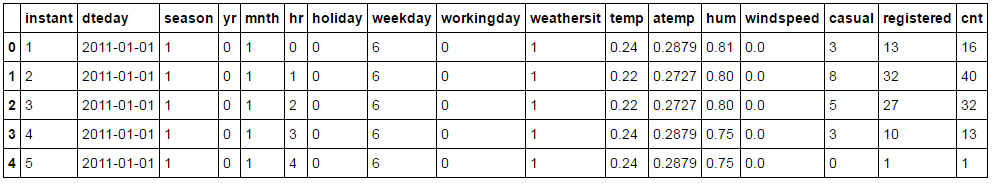
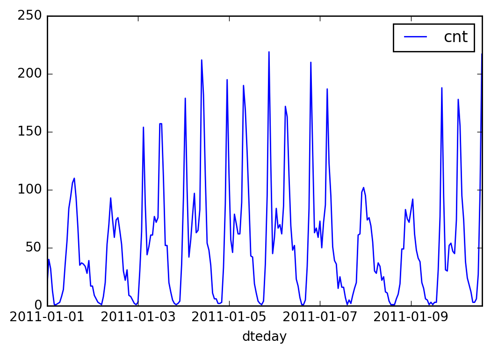
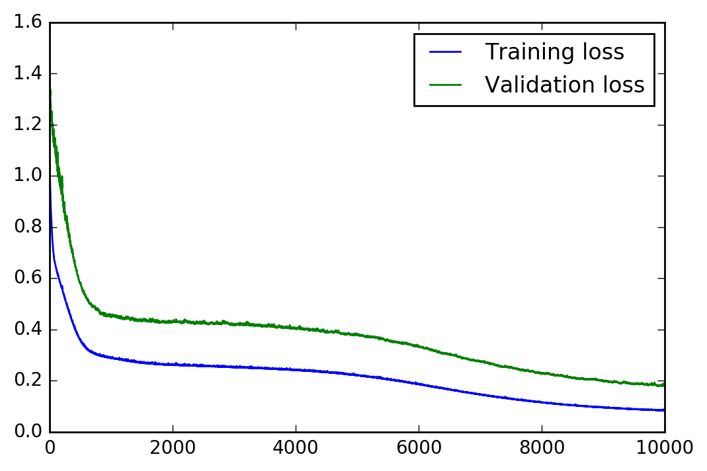

# DLND: Your First Neural Network

## Introduction

`Your First Neural Network` is a project of [Udacity's Deep Learning Nanodegree Class](https://www.udacity.com/course/deep-learning-nanodegree-foundation--nd101). 

The goal of this project is to make a neural network from scratch for predicting daily bike rental ridership.

##Environment of this project

**Software** 
* Windows7 (64bit)
* Python 3.5.2
* Anaconda 4.2.0
* Tensorflow 

**Hardware**

* CPU: Intel(R) Core(TM) i7-4790K CPU @ 4.00GHZ
* GPU: GeForce GTX 1080
* Memory: 8GB

**Dataset**

The dataset for this project is bike sharing data which is as follows.

The example graph of given data is as follows.

 

## Project

In this project, I built neural simple (1 hidden layer) neural network. 

I implemented not only structure but also forward and back propagation process with only `numpy`.

The structure of neural network is as follows.  

Therefore, the tasks of this project is as follows.

- Implement the `sigmoid function` to use as the activation function. 
- Implement the forward pass in the `train` method.
- Implement the backpropagation algorithm in the `train` method, including calculating the output error.
- Implement the forward pass in the `run` method.

##Result 
The graph of training and validation loss is as follows.

As you can see, the training and validation loss keep decreasing and it means the model trained well.

So, the **final result** of daily bike rental prediction is as follows.

I used only single hidden layer (very small) neural network, but it worked quite well. 

I didn't use any deep learning modules (i.e. tensorflow, pytorch, etc) but only used numpy.

Through this project, I could learn the process of `forward propagation` and `back propagation`, `activation function`, etc. 

