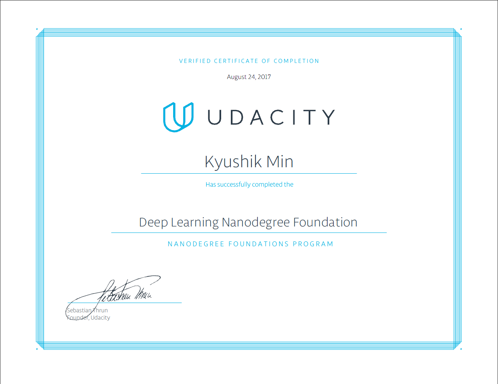

# Udacity DeepLearning Foundation

## Introduction 

This repository is for projects of [Udacity's Deep Learning nanodegree class](https://www.udacity.com/course/deep-learning-nanodegree-foundation--nd101). 

## Courses 

This course has 1 term.

The core curriculum of the course for now are as follows. :notebook_with_decorative_cover:
1. Neural Networks
2. Convolutional Neural Networks
3. Recurrent Neural Networks
4. Generative Adversarial Networks (GAN)
   ​

## Projects

The projects of the course are as follows. ​:clipboard:​

* Your First Neural Network
* Image Classification
* Generate TV Scripts
* Language Translations 
* Generative Adversarial Network(GAN) 

For now, I finished **All Projects**!! Yeah~~~ :tada::tada:

However, I have to write Readme.md for each projects.  

